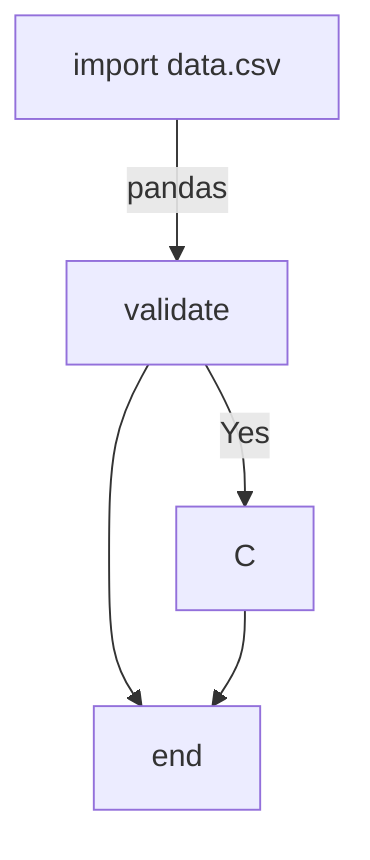

# ft_linear_regression

## Subject : ft_linear_regression

### Mandatory Part

Two programs :

## 1- predict the price of a car for a given mileage

`estimatePrice(mileage) = θ0 + (θ1 ∗ mileage)`

## 2-  train your model : perform a linear regression on the read dataset fil

`estimatePrice(mileage) = θ0 + (θ1 ∗ mileage)`



### Bonus part 
• Plotting the data into a graph to see their repartition.
• Plotting the line resulting from your linear regression into the same graph, to see
the result of your hard work !
• A program that calculates the precision of your algorithm.

### An introduction to machine learning
https://towardsdatascience.com/linear-regression-using-gradient-descent-97a6c8700931
https://towardsdatascience.com/linear-regression-and-gradient-descent-for-absolute-beginners-eef9574eadb0
https://www.analyticsvidhya.com/blog/2021/04/gradient-descent-in-linear-regression/


```
 supervised machine learning algorithm that finds the best linear-fit relationship on the given dataset, between independent and dependent variables. It is mostly done with the help of the Sum of Squared Residuals Method, known as the Ordinary least squares (OLS) method.

Mathematically, the main objective of the gradient descent for linear regression is to find the solution of the following expression,
Here, h is the linear hypothesis model, defined as h=θ0 + θ1x
```

 J(θ0, θ1) represents the cost function of the linear regression. 
 The cost function measures the Root Mean Squared error between the predicted value (pred) and true value (y). 
 


-> θj     : Weights of the hypothesis.
-> hθ(xi) : predicted y value for ith input.
-> j     : Feature index number (can be 0, 1, 2, ......, n).
-> α     : Learning Rate of Gradient Descent.


from 


https://www.w3schools.com/python/default.asp

https://www.w3schools.com/python/python_file_handling.asp
https://www.w3schools.com/python/pandas/pandas_csv.asp

### numpy
https://www.w3schools.com/python/numpy/default.asp
https://www.w3schools.com/python/pandas/default.asp
### matplotlib
https://www.w3schools.com/python/matplotlib_intro.asp

https://mplcursors.readthedocs.io/en/stable/

https://www.w3schools.com/python/python_ml_linear_regression.asp

https://neuronize.dev/
https://neuronize.dev/matplotlib-101-learn-matplotlib-in-10-minutes
https://neuronize.dev/pandas-101-learn-pandas-in-10-minutes


import `data.csv` file with `pandas` library


```python
import pandas as pd

df = pd.read_csv(r'data.csv', sep = ',')


```python
df.sort_values(by=['mileage'], inplace=True, ascending=True)
```


```python
import matplotlib.pyplot as plt
df.plot(x='', y='', kind='scatter')
df.plot(x='', y='', kind='line')
plt.show()
```

## Seaborn


## numpy
To transform a pandas dataframe into a numpy array. Simply using the to_numpy() function provided by Pandas.


```python
import numpy as np
df.to_numpy()
print(df)

```


)

### forbidden functions
`numpy.polyfit()` is depreciated to new polynomialAPI numpy.polynomial()


```R
mdata <- read.csv("data.csv")
df <- data.frame(mdata)
print (mean(df$price))
```
