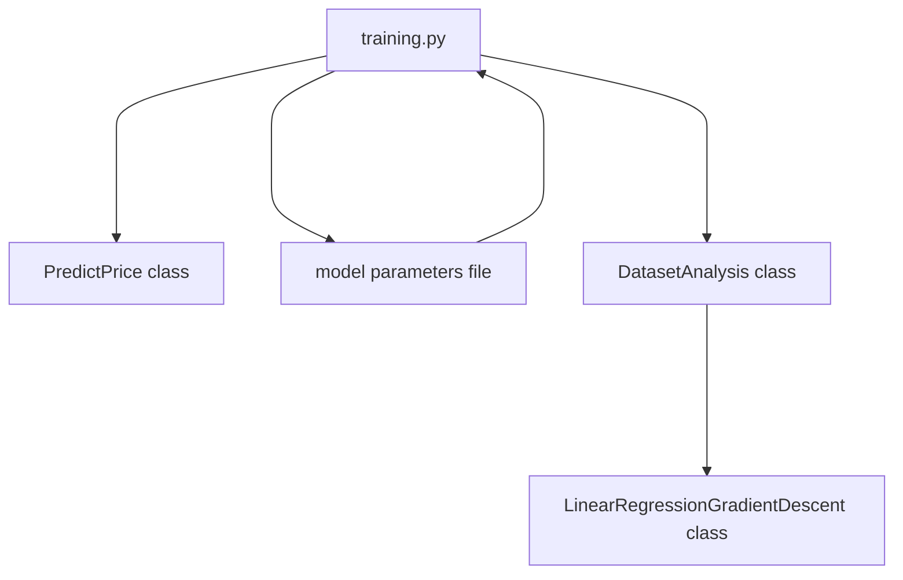

# ft_linear_regression

## Subject : ft_linear_regression

42 school project **ft_linear_regression** could be seen as an entrypoint to datascience branch of the curriculum.

It consists of implementing a ```simple linear regression with a single feature```, from scratch. Choice of programming language is free but should suitable for visualizing data. Using librairies is authorized, except for the ones that does all the work.For example, using python’s ```numpy.polynomial()``` function or ```scikit-learn``` library is considered cheating.

### Mandatory Part

A **first program** is predicting the price of a car for a given mileage. The prediction is based on the following model **hypothesis**

`estimatePrice(mileage) = θ0 + (θ1 ∗ mileage)`

where parameters **thetas** are set to 0 by default, if training did not occur yet.

A **second program** is training the model, from a ```data.csv``` train set. According to the hypothesis, both parameters **thetas** are updated with **gradient-descent** algorithm.

### Bonus part

• Plotting the data into a graph to see repartition.

• Plotting the line resulting from linear regression training into the same graph.

• Calculating the precision of the implemented algorithm.

---

### the dataset to train

Car _mileage_ (in Km) as inputs, car _price_ as output
km|price|
:---:|:---:
240000 |3650|
139800 |3800|
150500 |4400|


## My solution to the subject requirements

To implement linear regression from scratch, I chose **Python** language and ```numpy```, ```pandas``` and ```matplotlib``` librairies.

### Virtual environment

_Makefile_ capabilities was used to set up _virtual environment_ for **Python**.

```make``` command will install the virtual environment with dependencies specified in the ```requirements.txt``` file.

```make predict``` to execute the ```predict.py``` program.

```make training``` to execute the ```training.py``` program.

```make flake``` to check for norm with ```flake8```.

```make clean``` to remove ```__pycache__```  and ```.pyc files```.

```make fclean``` to remove the virtual environement after applying the ```clean``` rule.

### Project organization



### Linear regression

The objective is to find a solution to the linear hypothesis model.

For multivple linear regression, the output, _response_ ($Y$) linearily depends on a discrete number of $k$ independent variables ($X_j$) also called _predictors_.
With  $\theta_j$, as Weights of the hypothesis for $j$ being the feature index number (from 1 to k).

$$y = \theta_0 + \theta_1 * x_1 + \theta_2 * x_2 + ... + \theta_k * x_k$$

In our model, the hypothesis is that _price_ is depending only on _mileage_, therefore $\theta_0$ and $\theta_1$ are the weigths to be found by our algorithm.

For any x input value, and more specifically any $x_i$, there is an output predicted value $h(x_i)$, that can be calculated with the following linear relationship :

$$h(x_i)=\theta_0 +  \Theta_1 * x_i$$

For any given $x_i$, the calculated predicted value $h(x_i)$ might differ from the real value of $y_i$

The linear-fit relationship to the given dataset is based on the **Sum of Squared Residuals Method**, trying to find the miniminal $$\sum_{i=0}^m-1 (h(x_i) - y_i)^2$$ at the end of the learning process,

The **cost function** of the linear regression $J(\theta_0, \theta_2)$, measures the Root Mean Squared error between the predicted value (pred) and true value (y).

$$J(\theta_0, \theta_1) =  1 / (2*m) * \left( \sum_{k=1}^m (h(x_i)-y_i)^2 \right)$$ 


-> θj     : Weights of the hypothesis.
-> hθ(xi) : predicted y value for ith input.
-> j     : Feature index number (can be 0, 1, 2, ......, n).
-> α     : Learning Rate of Gradient Descent.


from 

