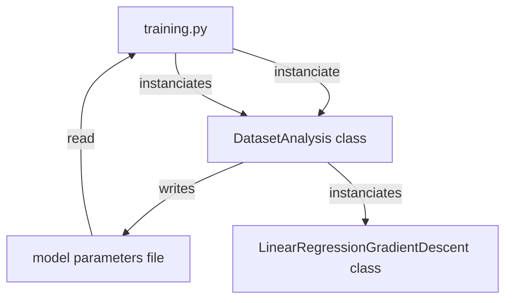

# ft_linear_regression

## Subject : ft_linear_regression

42 school project **ft_linear_regression** could be seen as an entrypoint to _datascience_ branch of 42 so-called ```outer-circle``` curriculum.
This project is an introduction the field.

It consists of implementing a ```simple linear regression with a single feature```, from scratch. Choice of programming language is free but should suitable for visualizing data. Using librairies is authorized, except for the ones that does all the work.For example, using python’s ```numpy.polynomial()``` function or ```scikit-learn``` library is considered cheating.

### Mandatory Part

A **first program** is predicting the price of a car for a given mileage. The prediction is based on the following model **hypothesis**

`estimatePrice(mileage) = θ0 + (θ1 ∗ mileage)`

where parameters **thetas** are set to 0 by default, if training did not occur yet.

A **second program** is training the model, from a ```data.csv``` train set. According to the hypothesis, both parameters **thetas** are updated with **gradient-descent** algorithm.

The two programs cannot directly communicate. Model parameters issued from training dataset, should be stored and be accessible independently of runtime (**Data persistency**).

### Bonus part

• Plotting the data into a graph to see repartition.

• Plotting the line resulting from linear regression training into the same graph.

• Calculating the precision of the implemented algorithm.

• Any feature making sense  

---

### Dataset to train

Monovariate : Car _mileage_ as inputs, car _price_ as output

km|price|
:---:|:---:
240000 |3650|
139800 |3800|
150500 |4400|
...|...|

---

## My solution to the subject requirements

To implement linear regression from scratch, I chose **Python** language.
Librairies : The power of ```numpy```, a pinch of ```pandas``` and ```matplotlib``` for visualisation.

### Virtual environment

a  _virtual environment_ is necessary so that python and its dependencies are running is an isolated manner, independently from python of the host machine. Virtualization with the help of ```Docker``` could be a way to do that in a more complex context. Here, only python installer ```pip```, ```python3``` and few libraries are needed.Thus, ```virtualenv``` is the most straightforward tool ([virtualenv doc.](https://virtualenv.pypa.io/en/latest/) and [python doccs](https://docs.python.org/3/tutorial/venv.html)) and can install a _virtual environment_  from these shell command :

```shell
virtualenv ./venv/
/venv/bin/pip install -r requirements.txt
```

Activation of the virtual environment :

```shell
source /venv/bin/activate
```

This will change the shell prompt, and allow to directly use ```pip``` or ```python``` of the ```venv``` with only one word instead of ```/venv/bin/``` prefix.

I used _Makefile_ capabilities to set up _virtual environment_ for **Python**, run programs or clean files. Of course, there is no compilation there since **Python** is an interpreted language.

```make``` command will install the virtual environment with dependencies specified in the ```requirements.txt``` file.

```make predict``` to execute the ```predict.py``` program.

```make training``` to execute the ```training.py``` program.

```make flake``` to check for norm with ```flake8```.

```make clean``` to remove ```__pycache__```  and ```.pyc files```.

```make fclean``` to remove the virtual environement after applying the ```clean``` rule.

### Project organization



### Linear regression

The objective is to find a solution to the linear hypothesis model.

For multiple linear regression, the output _response_ ($Y$) linearily depends on a discrete number of $k$ independent variables ($X_j$) also called _predictors_.
With  $\theta_j$, as Weights of the hypothesis for $j$ being the feature index number (from 1 to k).

  **Predicted output** $$y = \theta_0 + \theta_1 * x_1 + \theta_2 * x_2 + ... + \theta_k * x_k$$

In our model, the hypothesis is that _price_ is depending only on _mileage_, therefore $\theta_0$ and $\theta_1$ are the two weigths to be found by our algorithm.

For any x input value, and more specifically any $x_i$, an output predicted value $h(x_i)$ can be calculated with the following linear relationship.

  **Output predicted value** $$h(x_i)=\theta_0 +  \Theta_1 * x_i$$

For any given $x_i$, the calculated predicted value $h(x_i)$ might differ from the real value of $y_i$. These residual are specific to each $x_i$ but also to each $[\theta_0,  \theta_1]$ pair at any step of learning.

#### Gradient descent

The linear-fit relationship to the given dataset is based on the **Sum of Squared Residuals Method**, trying to find the minimize $$\sum_{i=1}^m (h(x_i) - y_i)^2$$ during the learning process,

The **cost function** of the linear regression $J(\theta_0, \theta_2)$, measures the Root Mean Squared error between the predicted value (pred) and true value (y).

**cost function**
$$J(\theta_0, \theta_1) =  \frac{1}{2m} \sum_{k=1}^m (h(x_i)-y_i)^2$$

To implement the ```gradient descent algorithm```, to keeping it simple, the slope of the cost function according to each $\theta$ direction, orientates us toward the minimal cost and tells if that $\theta$ needs to be increased or decreased. In addition to that, it also allows to update the value of that same given $\theta$.

_Partial derivative_ of $J(\theta_0, \theta_1)$ to $\theta_0$
 $$\delta(J(\theta_0, \theta_1))/\delta\theta_0 = \frac{\alpha}{m} \sum_{k=1}^m (h(x_i)-y_i)$$

_Partial derivative_ of $J(\theta_0, \theta_1)$ to $\theta_1$
  $$\delta(J(\theta_0, \theta_1))/\delta\theta_1 = \frac{\alpha}{m} \sum_{k=1}^m (h(x_i)-y_i)x_i$$

 $\alpha$     : Learning Rate of Gradient Descent.

$[\theta_0,  \theta_1]$ pair is updated by decrementing $\alpha * partial derivative$ amount. Linear algebra and ```numpy``` simplifies the equation translation into **python** coding language :

```python
partial_derivative = np.zeros(2)
partial_derivative[0] = np.mean(residual)
partial_derivative[1] = np.mean(np.multiply(self.x, residual))
self.theta -= self.alpha * partial_derivative
```

Developped explanation are found here.
]
[geeksforgeeks.com : gradient descent in linear regression articles](https://www.geeksforgeeks.org/gradient-descent-in-linear-regression/)

#### In summary

**Basically, at any step of the learning process:
  The pair $[\theta_0,  \theta_1]$ allows to calculate
  • the cost function J(\theta_0, \theta_2)$ given all the $x_i$ of the trainset.
  • the partial derivative for $theta_0$
  • the partial derivative for $theta_1$
  • update the $[\theta_0,  \theta_1]$ pair accordingly.

---

#### Dataset training

* **normalization** of the dataset. The values are in thousands order of magnitude (both _mileage_ and _price_).

* **data_persistence** : Subsequently, linear regression parameters has to be stored in a file, so that the model could be further used by the ```predict.py``` program.

* **model metrics** for linear regression analysis and a model accuracy report. [statistics_utils.py](./ft_linear_regression/statistics_utils.py)

#### Plots

* 3D plot : cost function** $J(\theta_0, \theta_1)$
* scatterplot of the trained dataset.
* same scatterplot with the regression line. The equation, leraning rate and epochs and shown.
* plot of cost function** $J(\theta_0, \theta_1)$ over epochs, to show the descent to the minimal cost.
* plot of hypothesis parameters $\theta_0$ and $\theta_1$ over epochs.

#### Prediction program

Allows to predict _price_ for a given _mileage_. This relies on persistent data, the model parameters file.

* model parameters are set to value zero, if the persistent model file cannot be read.
* _Exceptions_ are thrown if the user input _price_ is not valid.
